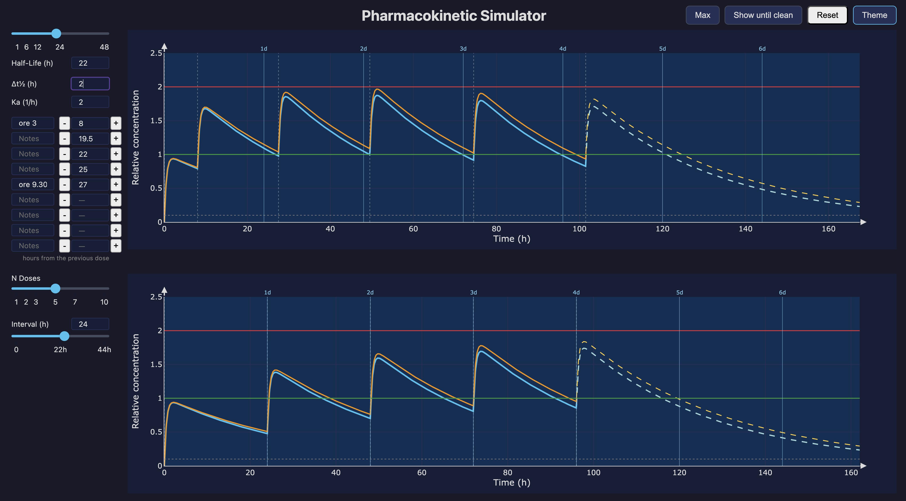

# PK Simulator

Single-compartment oral pharmacokinetic simulator with real-time interactive visualization.

## Features

### Panel 1 — arbitrary dosing
- Up to 8 doses (first at t=0, then 7 slots with interval in hours from the previous dose)
- Half-life slider (0.5–48 h) with direct numeric input
- Absorption constant Ka (0.1–10 /h)
- Optional secondary curve with modified half-life (Δt½)
- Solid line for observed period, dashed for projection (3×t½ beyond last dose)
- Reference lines: minimum efficacy (1.0, green), steady-state threshold (2.0, red), cleanup threshold (0.1, grey)
- Day markers on the x-axis (1d, 2d, 3d…)

### Panel 2 — regular dosing regime
- **N Doses** slider (1–10): evenly-spaced doses
- **Interval** slider (0–2×t½, step 0.5 h) with direct numeric input: hours between doses; range updates dynamically with half-life; 0 = all doses at t=0
- Same visual logic as panel 1 (curves, colors, reference lines, day markers)

### Shared controls
- **Max** button: toggle cubic spline through all local concentration peaks on both graphs
- **Clean** button: toggle x-axis cutoff at the point concentration drops to 0.1; stays active and recomputes when parameters change
- **Reset** button: restore all parameters to defaults
- Light / dark theme toggle
- All parameters persisted in browser localStorage across sessions



## Model

1-compartment model, first-order oral absorption:

```
C(t) = (Ka / (Ka - Ke)) × (e^(-Ke·t) - e^(-Ka·t))
```

- `Ke = ln(2) / t½`
- Multiple doses: linear superposition
- Y axis: relative concentration (1 = 1 dose unit)
- 2000 time points per curve

## Installation

Requires Python 3.10+.

```bash
git clone https://github.com/ghedo/pk-simulator.git
cd pk-simulator
./run.sh
```

`run.sh` automatically creates a virtual environment and installs dependencies (`dash`, `plotly`, `numpy`, `kaleido`) on first run. The app opens at [http://127.0.0.1:8050](http://127.0.0.1:8050).

Manual install:

```bash
python3 -m venv .venv
source .venv/bin/activate
pip install dash plotly numpy kaleido
python pharma_sim.py
```

## Usage

1. Set **Half-Life** with the slider or by typing directly
2. Set **Ka** (absorption rate constant)
3. Enter dose intervals in the dose slots (hours from the previous dose); use the **+**/**−** buttons for ±1 h steps or type any value including 0.5 h increments
4. Optionally set **Δt½** to overlay a second curve with a longer half-life
5. Use the **N Doses** and **Interval** sliders (panel 2) to simulate a regular dosing regimen
6. Use **Max** to overlay the peak concentration envelope on both graphs
7. Use **Clean** to zoom the x-axis to the elimination point; parameters can be changed while active
8. Use **Reset** to restore all parameters to defaults
9. Use the camera icon on the chart toolbar to export a PNG

---

## License

GPL-3.0. See [LICENSE](LICENSE).

## Author

ghedo (luca.ghedini@gmail.com) — 2026

Built with [Claude Code](https://claude.ai/code) by Anthropic.

## Development Effort

Built entirely through a conversation with **Claude Code** (claude-sonnet-4-6). Numbers extracted from local session transcripts (`~/.claude/projects/.../semiExp/*.jsonl`).

- **First message:** 2026-05-30
- **Last message:** 2026-05-31
- **Calendar span:** 2 days, 3 sessions, 1,058 messages (427 user + 631 assistant)
- **Active conversation time: ~293 minutes (~4.9 hours)**

*How active time is computed:* timestamps are sorted across all sessions; consecutive gaps ≤ 5 minutes are summed. Longer gaps (idle, browser testing) are discarded.

### Tokens

Cumulative token counts across all 3 sessions:

| Metric | S1+S2 | S3 | Total |
|---|---:|---:|---:|
| Input (non-cache) | 875 | 259 | 1,134 |
| Output | 394,366 | 217,430 | 611,796 |
| Cache write | 436,110 | 200,734 | 636,844 |
| Cache read | 40,369,268 | 10,764,650 | 51,133,918 |
| **Total** | **~41.2 M** | **~11.2 M** | **~52.4 M** |

### Cost

| Item | Tokens | Rate | Cost |
|---|---:|---:|---:|
| Input (non-cache) | 1,134 | $3.00 / 1M | $0.00 |
| Output | 611,796 | $15.00 / 1M | $9.18 |
| Cache write | 636,844 | $3.75 / 1M | $2.39 |
| Cache read | 51,133,918 | $0.30 / 1M | $15.34 |
| **Total** | | | **~$26.91** |

Cache-read tokens dominate because every turn re-reads the full conversation context from the prompt cache (5-minute TTL). The model produced ~612 K output tokens; ~637 K tokens of new context were written to cache across all three sessions.

### Caveman mode

All sessions ran entirely with [Caveman mode](https://github.com/anthropics/claude-code) (full level) active — a Claude Code skill that eliminates filler words, articles, and pleasantries from assistant responses while preserving all technical content.

Average output tokens per assistant message: **737 tok/msg** (session 1), **832 tok/msg** (session 2), **1,699 tok/msg** (session 3 — inflated by large code rewrites). Standard sessions on comparable projects without Caveman produce ~1,200–1,500 tok/msg on prose; session 3's higher average reflects the ratio of full-file writes vs. short text responses.

Applying a conservative 40% reduction estimate to prose output tokens: without Caveman, total output would have been substantially higher — estimated saving of ~400K output tokens (~$6 at $15/1M) across all three sessions.
